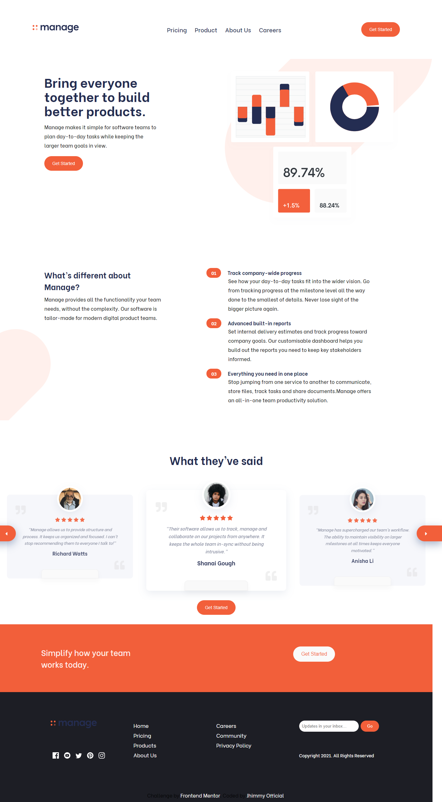

    # Frontend Mentor - Manage landing page solution

This is a solution to the [Manage landing page challenge on Frontend Mentor](https://www.frontendmentor.io/challenges/manage-landing-page-SLXqC6P5). Frontend Mentor challenges help you improve your coding skills by building realistic projects.

## Table of contents

- [Overview](#overview)
  - [The challenge](#the-challenge)
  - [Links](#links)
- [My process](#my-process)
  - [Built with](#built-with)
- [Author](#author)

## Overview

### The challenge

Users should be able to:

- View the optimal layout for the site depending on their device's screen size
- See hover states for all interactive elements on the page
- See all testimonials in a horizontal slider
- Receive an error message when the newsletter sign up `form` is submitted if:
  - The `input` field is empty
  - The email address is not formatted correctly

### Links

- Solution URL: https://github.com/Jhimmyofficial/manage-landing-page
- Live Site URL: https://jhimmyofficial.github.io/manage-landing-page/

### Screenshot

[]

### Built with

- Semantic HTML5 markup
- CSS custom properties
- Flexbox
- CSS Media Queries
- Mobile-first workflow
- [Swiper.Js](https://swiperjs.com/) For Carousel

## Author

- Frontend Mentor - [@Jhimmyofficial](https://www.frontendmentor.io/profile/Jhimmyofficial)
- Twitter - [@jhimmyofficial](https://www.twitter.com/@jhimmyofficial)
